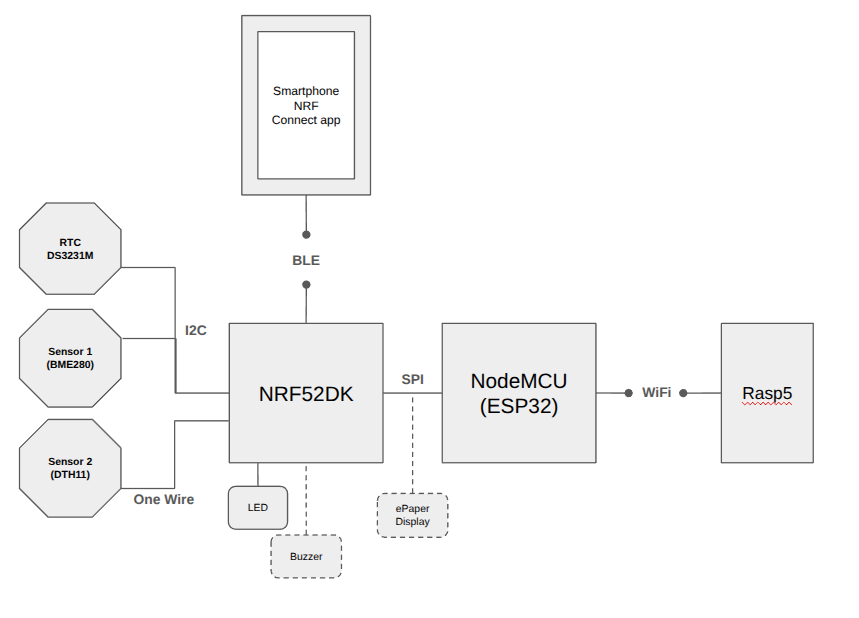

# SensMonitor - Personal Sensor Monitor Project

> In current development

SensMonitor is a personal project where the goal is to apply concepts and technologies I have learned throughout my professional career. Currently, there is no final prototype implemented. The architecture presented here is my initial design and may undergo slight changes as development progresses.

> **Note:** This repository is public for overview and documentation purposes. Access to the full source code is **available upon request**. Please contact the author to obtain it.

The project combines concepts from **embedded systems**, **software engineering**, and **computer networks**.

---

## Key Features

- Support for multiple environmental sensors:
  - **DHT11** (temperature & humidity)  
  - **BME280** (temperature, humidity, and pressure)  
  - **RTC DS3231M** (timestamping)  
- **BLE peripheral** with custom services and notifications  
- Planned **Wi-Fi communication** via ESP32 and SPI link  
- **REST API** (Java + Spring Boot) for sensor data handling  
- **Grafana dashboard** for visualization  
- Modular architecture with clear separation of concerns  
- Extendable for additional sensors, alerts, or communication protocols  

---

## Overview

The project aims to collect data from a set of environmental sensors (2 or 3), measuring metrics such as **temperature** and **humidity**, and to transmit these readings through different communication technologies such as **BLE** and **Wi-Fi**. Collected data should be viewable on both a **smartphone** and a **computer dashboard**.

Development is being done using the hardware currently available, which may require some adaptations compared to a commercial prototype.

---

## Requirements

To reproduce or extend this project, the following are required:

### Hardware
- **nRF52DK (nRF52832)** development kit  
- **ESP32 (NodeMCU)** module for Wi-Fi communication  
- **DHT11** sensor (temperature & humidity)  
- **BME280** sensor (temperature, humidity, and pressure)  
- **RTC DS3231M** module for timestamping  
- Optional: **Buzzer** for threshold alerts  
- USB to UART adapter (e.g., FTDI) for debugging

### Software
- **nRF Connect SDK v2.9.1** with **Zephyr v3.7.99**  
- **VSCode** with nRF Connect extensions (recommended)  
- **ESP-IDF** (for ESP32 firmware development)  
- **Java 17 LTS+** with **Spring Boot** (for REST API)  
- **Grafana** for dashboard visualization  
- **Docker** (optional, for deployment and containerization)  

---

## Architecture

The figure below shows the current architecture of the project:

1. **Sensors and Microcontroller**
   - Two sensors (DHT11 and BME280) are periodically read by a **nRF52 microcontroller**.  
   - The **RTC DS3231M** provides timestamps for each reading.  

2. **Communication**
   - **BLE (Bluetooth Low Energy):** sensor data is transmitted to a smartphone.  
   - **Wi-Fi:** data is transmitted via an **ESP32 microcontroller**, which receives data from the nRF52 (planned via SPI). The ESP32 sends the data to a REST API running on the local network.  

3. **Software**
   - The **REST API** is implemented in **Java** using **Spring Boot**, supporting `PUT`, `POST`, and `GET` methods.  
   - Data is stored in a local database.  
   - A **Grafana dashboard** visualizes sensor readings in real time.  

4. **Future Enhancements**
   - Deployment with **Docker** and potentially **Kubernetes** for scalability and containerized management.  
   - Additional sensors or new communication protocols may be added.

> Each module of the project will have a dedicated README explaining its implementation in detail.

---

## Documentation Links

- [BLE & Sensor Services](README_ble.md) – Details on BLE manager, sensor services, and notifications.  
- [Sensors](README_sensors.md) – Details on DHT11, BME280, RTC drivers, and shared data handling.  

---

## Project Roadmap / Priorities

1. **Test SPI communication** between nRF52 and ESP32.  
2. **Implement Wi-Fi communication** on ESP32 to send data via REST API.  
3. **Develop REST API** for storing and serving sensor data.  
4. **Create Grafana dashboard** for visualization of temperature, humidity, and alerts.  
5. **Integrate alert thresholds** for notifications or buzzer signals.

> This roadmap is subject to changes as the project evolves.

---

## Final Notes

- The project is **modular**: new sensors or services can be added easily.  
- Timer-based readings ensure non-blocking periodic updates.  
- The architecture may evolve as new technologies or improvements are added.
