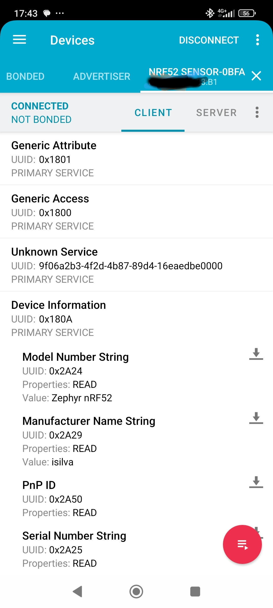
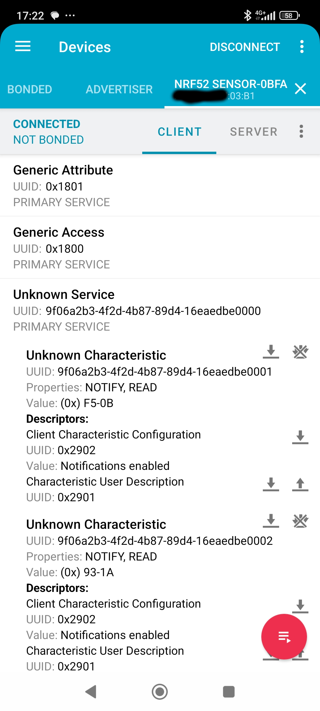
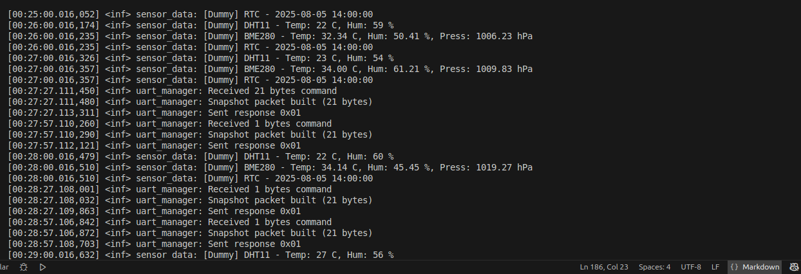
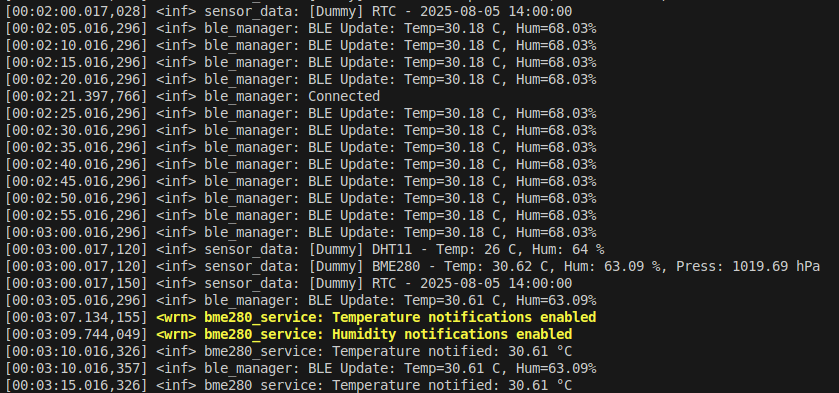

# Bluetooth Low Energy (BLE)

## Overview
The BLE stack in this project is built on top of the Zephyr Bluetooth subsystem.  
The nRF52832 runs as a **peripheral** device, advertising a custom service that exposes environmental data and configurable thresholds to a central device (e.g., Raspberry Pi, smartphone).  

The BLE module provides:
- Advertising with custom 128-bit UUIDs and dynamic device name  
- Connection handling callbacks  
- Services and characteristics for BME280 sensor data (temperature, humidity, thresholds)  
- Notifications for real-time updates  
- Persistent thresholds stored in non-volatile flash memory (Not yet)
- Timer-based periodic sensor readings  

---

## GATT Services and Characteristics

### BME280 Service
- **Service UUID**: `12345678-1234-5678-1234-56789abc0000`

#### Characteristics
- **Temperature**  
  - UUID: `12345678-1234-5678-1234-56789abc0001`  
  - Properties: *Read, Notify*  
  - Unit: °C (signed integer, scaled if necessary)  

- **Humidity**  
  - UUID: `12345678-1234-5678-1234-56789abc0002`  
  - Properties: *Read, Notify*  
  - Unit: %RH (unsigned integer)  

- **Thresholds**  
  - UUID: `12345678-1234-5678-1234-56789abc0003`  
  - Properties: *Read, Write*  
  - Format: Array of 4 values → `[temp_min, temp_max, hum_min, hum_max]` (each 8-bit)

---

## Advertising

### Device Name
The device advertises using a custom advertising name:

`XXXX` are the last 4 digits of the nRF52 MAC address.

**Why Name + MAC?**  
The advertising name with the last 4 digits of the MAC ensures that multiple devices can be distinguished even if deployed in the same area.

### Advertising Data Content
The advertising packet typically includes:
- Device Name (`EnvMonitor-XXXX`)  
- UUIDs of available services  
- Flags (e.g., "general discoverable mode")  

---

## Timer and Periodic Reading
- The nRF52 uses a **timer-based mechanism** to periodically read sensor values.  
- A work queue or thread triggers the read function at a fixed interval (e.g., every 2 seconds).  
- After each read, the **BLE characteristics are updated** and notifications sent if enabled.  
- This approach allows **continuous monitoring** without blocking the main loop.  

---

## Driver Implementation

### Service Layer
- **File**: `ble/BME280_service.c`  
- **Header**: `ble/BME280_service.h`  

#### Responsibilities
- Defines and registers the **BME280 GATT service**.  
- Provides the characteristic definitions and permissions.  
- Handles read, write, and notify operations for temperature, humidity, and thresholds.  
- Exposes update functions to other modules:  
  - `bme280_update_values(int16_t temp, uint16_t hum)` → updates GATT values and sends notifications if enabled.  
  - `bme280_update_thresholds(const uint8_t *data, size_t length)` → stores new thresholds when written from the central.  

---

### BLE Manager
- **File**: `ble/ble_manager.c`  
- **Header**: `ble/ble_manager.h`  

#### Responsibilities
- Initializes and manages the BLE stack.  
- Starts advertising with service UUID and dynamic device name.  
- Provides notification helpers:  
  - `ble_notify_temperature(int16_t temp)`  
  - `ble_notify_humidity(uint16_t hum)`  
- Handles connection events:  
  - `connected()` callback on successful central connection  
  - `disconnected()` callback when the central disconnects  
- Links service registration (`bt_gatt_service_register`) to the BLE initialization flow.  

---

## Data Flow
1. The **BME280 sensor driver** collects new values (temperature and humidity) via timer-triggered reads.  
2. These values are passed to the **BME280 BLE service** using `bme280_update_values()`.  
3. The GATT characteristics are updated, and if the central has subscribed, **notifications** are sent.  
4. The central can also write to the **Thresholds characteristic** to configure min/max values.  
5. Updated thresholds are stored persistently in flash and reloaded on boot.  

---

## Notes
- Built with **Zephyr v3.7.99** and **nRF Connect SDK v2.9.1**.  
- BLE stack uses the **SoftDevice Controller (SDC)**.  
- Notifications are currently enabled for **temperature** and **humidity**.  
- Architecture is modular → additional services (e.g., DHT11, RTC, Wi-Fi bridge) can be added with the same design pattern. 

### Some Example images

-NRFConnect app

- APP log on RTT

