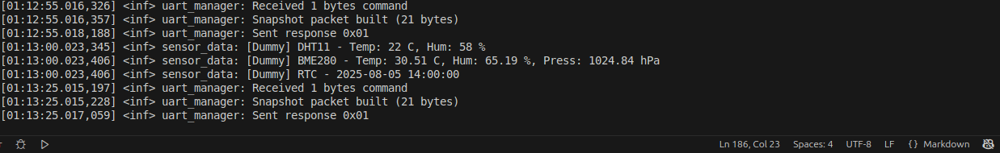
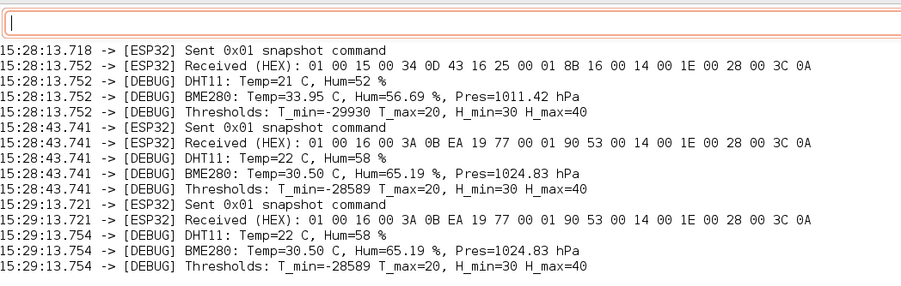

# UART Manager Overview

The UART Manager handles communication between the **nRF52 (slave)** and an external master, such as a **NodeMCU (ESP32)**.
It implements a single-command interface for requesting sensor snapshots or updating thresholds.

---

## Hardware Connections

### NRF52DK Device Tree Overlay

Add the following snippet to your overlay file (`prj.overlay`) to enable UART0 at 115200 baud:

```dts
&uart0 {
    status = "okay";
    current-speed = <115200>;
    pinctrl-0 = <&uart0_default>;
    pinctrl-1 = <&uart0_sleep>;
    pinctrl-names = "default", "sleep";
};
```

Also in your proj.conf file you must add this lines:


```bash

CONFIG_UART_INTERRUPT_DRIVEN=y  # Enable UART driver
CONFIG_SERIAL=y                 # Enable Zephyr serial driver
CONFIG_LOG_BACKEND_UART=n       # enable UART for logging (but we keep RTT)

```

### NodeMCU - ESP32

| NodeMCU Pin | nRF52 Pin | Signal | Notes                       |
| ----------- | --------- | ------ | --------------------------- |
| 16          | P0.08     | RX     | NodeMCU receives from nRF52 |
| 17          | P0.06     | TX     | NodeMCU sends to nRF52      |
| GND         | GND       | -      | Common ground required      |

> **Important:** Both boards must share a common ground. USB powering alone is not enough. Do not connect 3.3V or 5V lines directly — both boards are already powered via USB.

---

## UART Command Protocol

### Commands

| Command | Description             | TX Response                                     |
| ------- | ----------------------- | ----------------------------------------------- |
| 0x01    | Request sensor snapshot | Full snapshot + thresholds                      |
| 0x02    | Update thresholds       | Echo command + status (0x00 = OK, 0xFF = error) |
| Other   | Unknown command         | 0xFF (error)                                    |

---

## TX Buffer Layout (Big-Endian)

### Snapshot (0x01)

| Byte Index | Field                  | Type    | Notes                           |
| ---------- | ---------------------- | ------- | ------------------------------- |
| 0          | Command Echo           | uint8   | Echoes 0x01                     |
| 1-2        | DHT11 Temperature      | int16_t | °C, integer                     |
| 3-4        | DHT11 Humidity         | int16_t | %RH, integer                    |
| 5-6        | BME280 Temperature     | int16_t | °C × 100                        |
| 7-8        | BME280 Humidity        | int16_t | % × 100                         |
| 9-12       | BME280 Pressure        | int32_t | hPa × 100                       |
| 13-14      | Temp Min Threshold     | int16_t | °C × 100                        |
| 15-16      | Temp Max Threshold     | int16_t | °C × 100                        |
| 17-18      | Humidity Min Threshold | int16_t | % × 100                         |
| 19-20      | Humidity Max Threshold | int16_t | % × 100                         |
| 21-31      | Reserved / future use  | -       | Can be extended for new sensors |

---

### Update Thresholds (0x02)

| Byte Index | Field                  | Type    | Notes                |
| ---------- | ---------------------- | ------- | -------------------- |
| 0          | Command Echo           | uint8   | Echoes 0x02          |
| 1-2        | Temp Min Threshold     | int16_t | °C × 100             |
| 3-4        | Temp Max Threshold     | int16_t | °C × 100             |
| 5-6        | Humidity Min Threshold | int16_t | % × 100              |
| 7-8        | Humidity Max Threshold | int16_t | % × 100              |
| 9-31       | Reserved               | -       | For future expansion |

---

## RX Buffer (Master → nRF52)

| Byte Index | Field   | Notes                                               |
| ---------- | ------- | --------------------------------------------------- |
| 0          | Command | 0x01 to request snapshot, 0x02 to update thresholds |
| 1-31       | Payload | Reserved or threshold values depending on command   |

---

## UART Data Flow Overview

```
      NodeMCU (ESP32) Master
      +---------------------+
      |      UART TX/RX     |
      +----------+----------+
                 |
        Command (0x01 or 0x02)
                 |
                 v
            +-----------+
            | nRF52 MCU |
            | UART Slave|
            +-----------+
                 |
         +-------+-------+
         |               |
   Sensor Data        Thresholds
  (DHT11 & BME280)    (temp/hum)
         |               |
         +-------+-------+
                 |
          Fill TX buffer
                 |
                 v
         Send response to NodeMCU
```

### What happens on each microcontroller

**NodeMCU (ESP32 / Master)**:

* Sends `0x01` to request sensor data snapshot.
* Reads RX buffer of 21 bytes and decodes sensor readings and thresholds.
* Can send `0x02` to update thresholds; waits for echo/status. `TBD yet`
* Handles debug output via Serial for development.

**nRF52 (Slave)**:

* Polls UART for incoming commands.
* On `0x01`, reads latest sensor snapshot and thresholds, packs them into TX buffer, sends back 21 bytes.
* On `0x02`, reads thresholds from RX buffer, updates internal configuration, echoes status.
* Ignores unknown commands (returns 0xFF).
* Background threads maintain sensor measurements and threshold states.

---

## Example NodeMCU Code

```cpp
// Send snapshot request
nrfSerial.write(0x01); 
while(nrfSerial.available() < 21) { delay(1); }

uint8_t buf[21];
nrfSerial.readBytes(buf, 21);

int16_t dht_temp = (buf[1]<<8)|buf[2];
int16_t dht_hum  = (buf[3]<<8)|buf[4];
int16_t bme_temp = (buf[5]<<8)|buf[6];
int16_t bme_hum  = (buf[7]<<8)|buf[8];
int32_t bme_pres = ((int32_t)buf[9]<<24)|((int32_t)buf[10]<<16)|((int32_t)buf[11]<<8)|buf[12];
```

---

## Debugging Tips

* Print each received byte in HEX to confirm correct packet parsing.
* Ensure common ground between boards.
* Avoid `\n` terminators — the nRF52 expects raw binary commands.
* If packets appear misaligned, check RX/TX wiring and baudrate.

---

## Adding New Sensors

1. Update `sensor_snapshot_t` on the nRF52 with new fields.
2. Add corresponding indices in the TX buffer.
3. Update README layout and NodeMCU decoding.
4. Keep 21-byte snapshot size adjustable if needed (increase buffer).

---

## Some Example images

- NRFConnect app log on RTT



- NodeMCU (ESP32)

